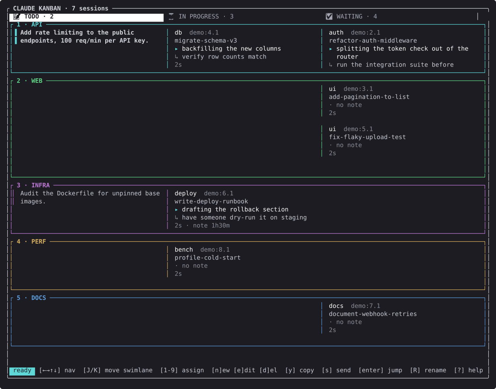
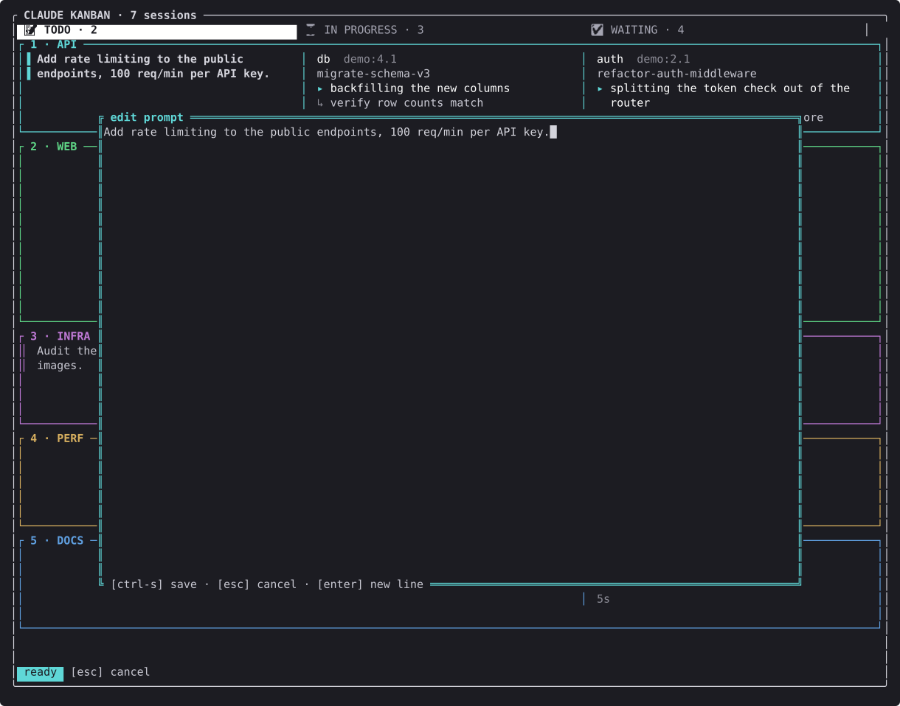
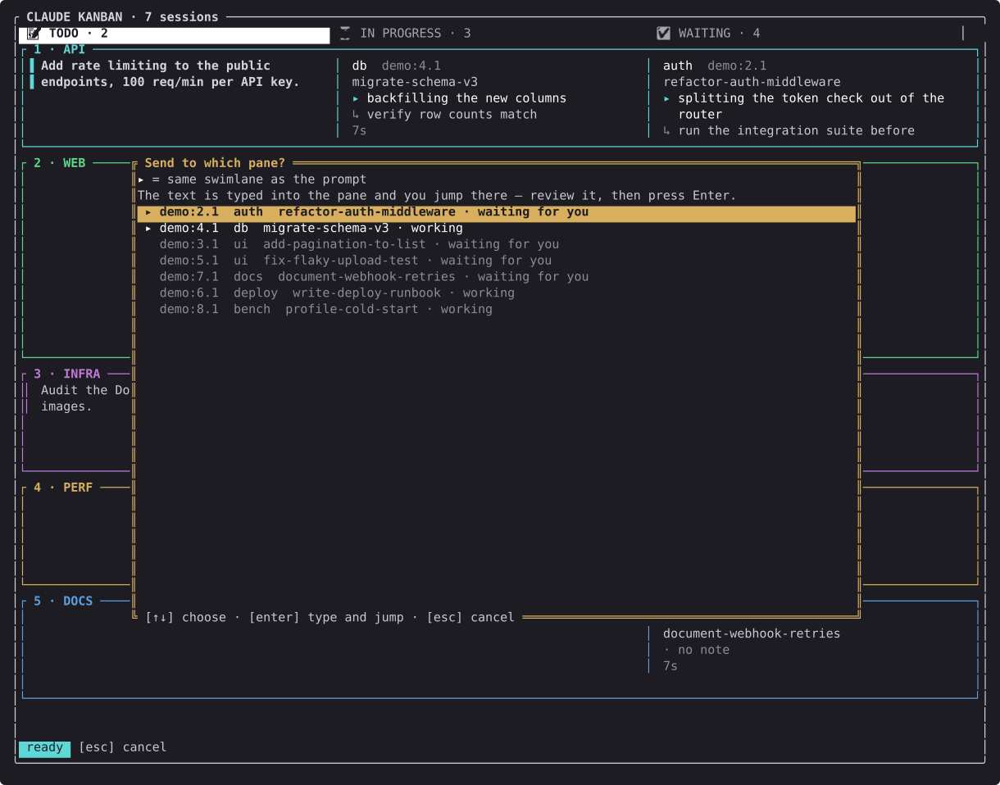
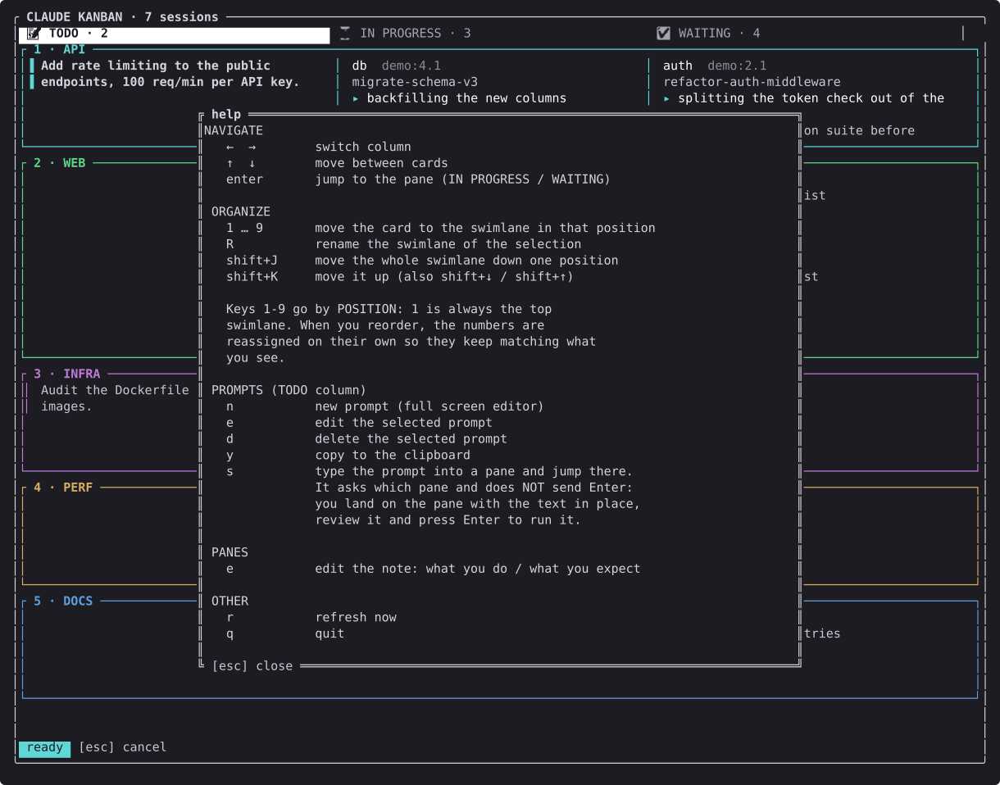

# ckan

A terminal kanban board for the Claude Code sessions you have running across
tmux panes. The name is short for **C**laude **KAN**ban — it has nothing to do
with [CKAN](https://ckan.org), the open data portal.

If you keep several Claude Code sessions open at once — one refactoring, one
writing tests, one you started an hour ago and forgot about — `ckan` gives you
the one thing tmux does not: a single screen showing which of them are working
and which are waiting on you.



Three columns, nine swimlanes. The **columns** are automatic: `ckan` reads each
pane's state from tmux and moves cards between *in progress* and *waiting* on
its own. The **swimlanes** are yours — group panes by project, by priority, by
whatever you like.

## Why

tmux tells you a pane exists. It does not tell you that the session in window 5
finished twenty minutes ago and has been idle ever since, or that the prompt you
meant to send to the API session went to the frontend one.

`ckan` answers three questions at a glance:

- **What is running right now?**
- **What is waiting for me, and for how long?** — the longest-waiting card sorts
  to the top, and anything idle for over an hour is flagged.
- **What did I mean to do next?** — each pane carries two notes, *what I'm
  doing* and *what I expect next*, so returning to a session after an hour does
  not start with "…where was I?"

## Requirements

- tmux (developed against 3.5a)
- Rust 1.75 or newer, to build

## Install

```bash
git clone https://github.com/JavierAbrego/ckan.git
cd ckan
cargo build --release
install -m755 target/release/ckan ~/.local/bin/ckan
```

Run it **inside tmux**:

```bash
ckan
```

It works best in a window of its own:

```bash
tmux new-window -n kanban ckan
```

## The workflow

The board is built around one loop: **write a prompt → send it to a session →
watch it move across the board.**

### 1. Write prompts before you need them

Press `n` to open a full-screen editor and write a prompt. It stays in the
**TODO** column until you use it, so you can draft work in advance instead of
composing it under pressure in a live session.



### 2. Send it to a session

Press `s` on a prompt and pick a destination. Panes in the prompt's own
swimlane are listed first and marked `▸`; within each group, sessions that are
waiting for you come before ones that are busy.



The prompt is typed into the target pane and `ckan` jumps you there — **without
pressing Enter**. You read it in place and send it yourself. That is deliberate:
typing into the wrong live session is the one mistake this tool should never
make on your behalf.

### 3. Follow it across the board

Once Claude starts working, the card moves to **IN PROGRESS**. When it finishes
and needs you, it moves to **WAITING** with a timer. Press `enter` on any card to
jump straight to that pane.

### Notes: what you're doing, what comes next

Press `e` on a pane to record two lines — `▸` what you are doing, `↳` what you
expect next. A note untouched for more than an hour is labelled with its age, so
you can tell at a glance which notes still reflect reality.

## Keys

| Key | Action |
|---|---|
| `←` `→` `↑` `↓` | Move between columns and cards (`h` `j` `k` `l` also work) |
| `J` / `K` | Move the whole swimlane down / up (also `Shift`+`↓`/`↑`) |
| `1`–`9` | Send the selected card to that swimlane |
| `R` | Rename the swimlane |
| `n` | New prompt |
| `e` | Edit — the prompt in TODO, or the note on a pane |
| `d` | Delete the selected prompt |
| `y` | Copy the prompt to the clipboard |
| `s` | Send the prompt to a pane |
| `enter` | Jump to the pane |
| `r` | Refresh now |
| `?` | Help |
| `q` | Quit |



## Where state lives

Swimlanes, prompts, and notes are stored in `~/.local/state/ckan/board.json`
(or `$XDG_STATE_HOME/ckan/` if you set it).

State is keyed by tmux's **pane id** (`%17`), not by position (`0:2.1`), so
your notes and swimlane assignments survive reordering windows. When a pane
closes, its entry is dropped.

## Known limitations

Worth knowing before you rely on it.

**Session state is read from the pane title.** Claude Code writes `✳` when idle
and a braille spinner while working, and `ckan` classifies on that. It is
presentation, not a stable API: if a future version changes the format, every
card lands in the wrong column. The patterns are isolated at the top of
`src/tmux.rs` so fixing it is a one-line change.

**Timers start at zero when you launch the board.** tmux does not record when a
pane last changed title, so transitions have to be observed live. Close and
reopen `ckan` and the counters restart — swimlanes and notes persist, timers
do not.

**Clipboard goes through OSC52.** `y` works over SSH if your terminal supports
it, with `set-clipboard on` or `external` in tmux. The tmux buffer is always
written as a fallback, so `prefix + ]` pastes even when OSC52 does not get
through.

**It wants a wide terminal.** The key bar is a single line of about 130
characters, so below roughly 100 columns it gets cut off on the right, and the
help overlay needs about 46 rows to show its last section. Everything still
works — you just stop being able to read the reminders. Give it a full-width
window.

## Project layout

| File | Contents |
|---|---|
| `src/tmux.rs` | Everything that talks to tmux, including the state-detection patterns |
| `src/store.rs` | Persistence of swimlanes, prompts, and notes |
| `src/app.rs` | In-memory state, navigation, actions |
| `src/ui.rs` | Rendering and overlays |
| `tools/` | Development tooling — screenshot generation, not part of the binary |

Source comments are in Spanish; they are the author's working notes. Everything
the user sees is in English.

## Regenerating the screenshots

The images above are captured from the real interface, not mocked up. To rebuild
them after a UI change, from inside tmux:

```bash
./tools/screenshots.sh
```

It builds a throwaway demo scenario in its own tmux window and writes to
`docs/img/`. It never reads your real sessions and never touches your real
`board.json`.

## License

MIT
